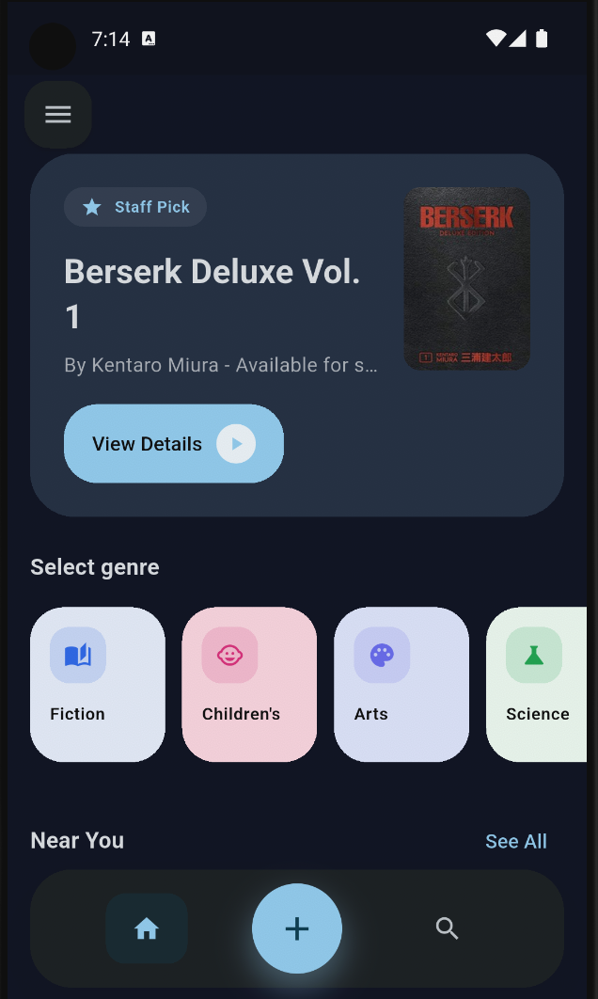
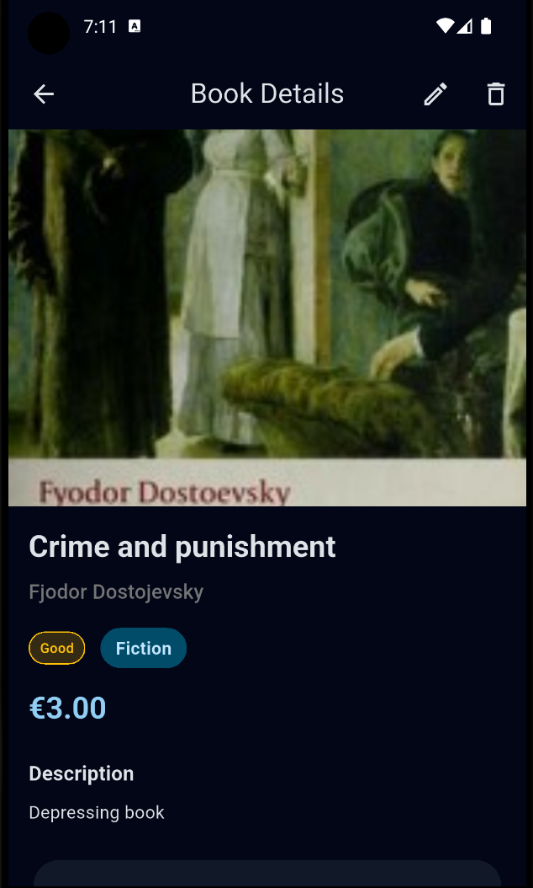
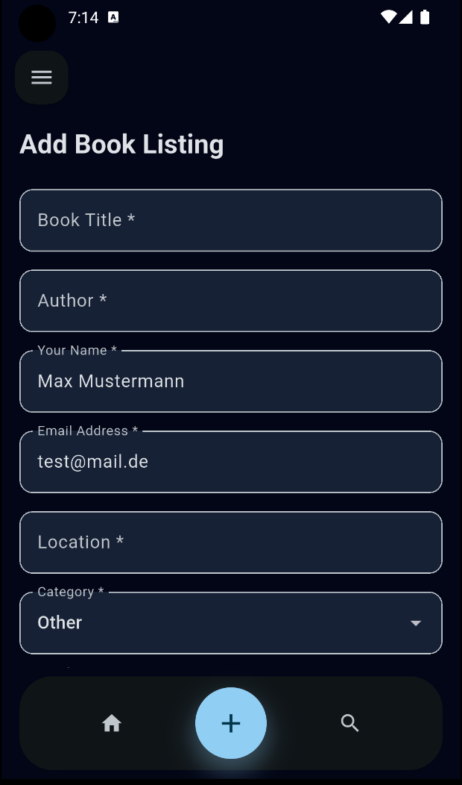

# BookSwap Marketplace

A Flutter application that lets users browse, buy, swap, and give away books within their community. Users can create an account, post listings with title, author, condition, price, and contact details, and manage their own listings (edit & delete). The app supports infinite scrolling, search, category/type filtering, and persistent dark/light theme preferences.

---

## Screenshots

| Browse | Book Detail | Add Listing |
|--------|-------------|-------------|
|  |  |  |

---

## Setup & Run Instructions

**Requirements**
- Flutter SDK: **3.41.6** (stable)
- Dart SDK: 3.x
- Android emulator or physical device (iOS/Android)

**Installation**

```bash
# 1. Clone the repository
git clone <repo-url>
cd book_swap_marketplace

# 2. Install dependencies
flutter pub get

# 3. Run the app
flutter run

# 4. Run all tests
flutter test
```

**Firebase Setup**

The app requires Firebase for authentication and data persistence.

```bash
# Install FlutterFire CLI
dart pub global activate flutterfire_cli

# Configure Firebase (select your project)
flutterfire configure
```

Then in the [Firebase Console](https://console.firebase.google.com):

1. **Firestore** — Create a database and deploy security rules:
```bash
firebase deploy --only firestore:rules --project <your-project-id>
```

2. **Authentication** — Enable the **Email/Password** sign-in provider under *Authentication → Sign-in method*.

> Without Firebase the app falls back to `assets/data/books.json` for browsing, but login and listing creation will not work.

---

## Features

- **Authentication** — Register and sign in with email and password via Firebase Auth
- **Browse** — Infinite-scroll book feed with featured "Staff Pick" hero card
- **Search** — Full-text search by title or author with persistent filter state
- **Filter** — Filter by category (Fiction, Science, Technology, …) and listing type (Sale, Swap, Free)
- **CRUD** — Authenticated users can add, edit, and delete their own listings
- **Book Detail** — Full listing view with cover image, condition badge, and seller contact
- **Settings** — Change display name, reset password via email, sign out, toggle dark/light theme
- **About** — App info and developer contacts

---

## Main Packages

| Package | Version | Purpose |
|---------|---------|---------|
| `flutter_riverpod` | ^2.5.1 | Reactive state management — books list, search, filters, auth, and theme |
| `go_router` | ^14.2.4 | Declarative navigation with named routes and auth guard |
| `firebase_core` | ^3.3.0 | Firebase SDK initialization |
| `firebase_auth` | ^5.3.0 | Email/password user authentication |
| `cloud_firestore` | ^5.3.0 | Cloud database for persistent book listings |
| `shared_preferences` | ^2.2.2 | Persists the user's light/dark theme preference |
| `cached_network_image` | ^3.3.1 | Efficient loading and caching of book cover images |
| `intl` | ^0.19.0 | Date formatting for listing timestamps |
| `mockito` | ^5.4.4 | Mocking in unit and widget tests |

---

## Project Structure

```
lib/
├── models/         # BookListing model with fromJson/toJson and coverUrl getter
├── services/       # BookService (JSON fallback), FirestoreBookService, AuthService
├── providers/      # BooksNotifier, ThemeNotifier, AuthProvider, SearchFiltersProvider
├── screens/        # browse, search, detail, add_listing, login, register, settings, about
├── widgets/        # BookListTile, ConditionBadge, LoadingWidget, AppErrorWidget, EmptyStateWidget
├── utils/          # Validators (all form/search validation logic)
├── theme/          # Light & dark MaterialTheme definitions
└── router/         # GoRouter configuration with auth guard

assets/
└── data/books.json # Local seed data (fallback when Firebase is unavailable)

test/
├── models/         # BookListing fromJson/toJson unit tests
├── utils/          # Validator function unit tests
├── providers/      # BooksNotifier unit tests
└── widgets/        # BookListTile widget tests
```

---

## Developers

| Name | Email |
|------|-------|
| Gino Chianese | chianese.gino@study.thws.de |
| Elisa Holzheid | elisa.holzheid@study.thws.de |
| Edin Putzu | edin.putzu@study.thws.de |
